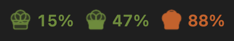
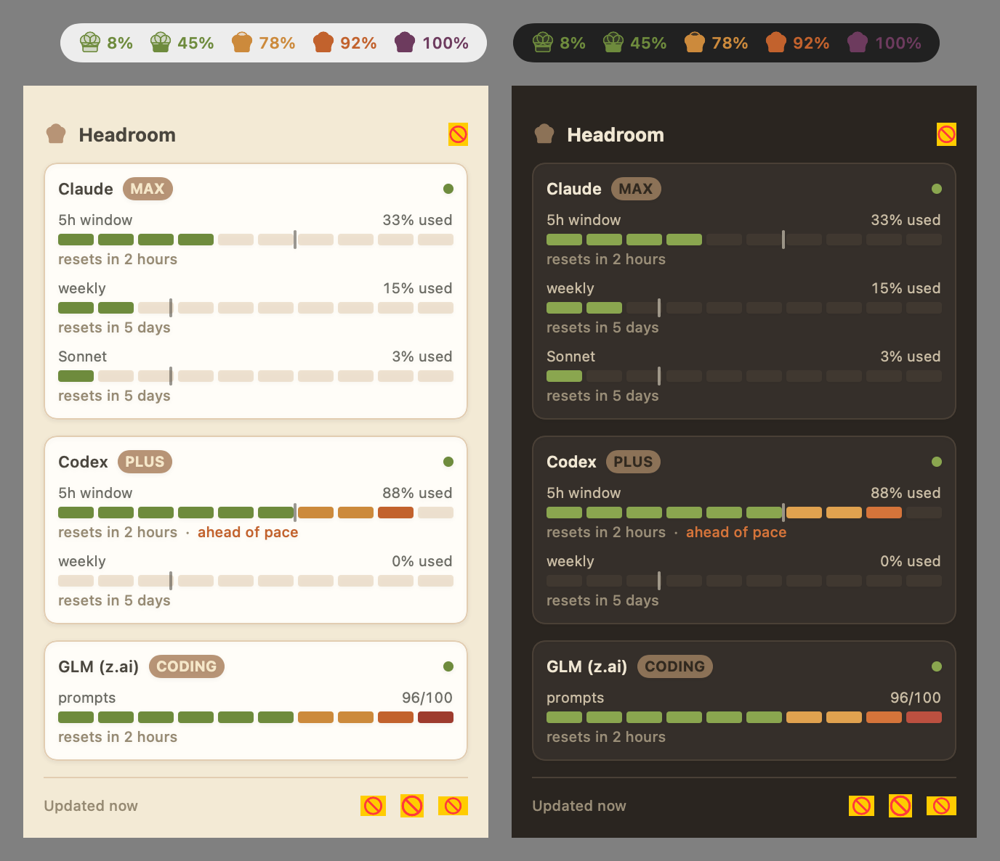

# Headroom

A native macOS menu-bar app that shows how much of your AI coding subscriptions you have left, across every provider you pay for, in one place.



Claude, Codex, GLM (z.ai), MiniMax, and Kimi each have their own usage dashboard buried in their own site. Headroom reads the authoritative meter from each one and puts the remaining headroom, plus reset countdowns, in your menu bar. It reads each provider's *own* quota, not a gateway estimate or a cost guess.



## Providers

All providers are optional and toggle on/off in Settings. The default set works with zero or near-zero setup.

| Provider | What it reads | Setup |
|---|---|---|
| **Claude** | `api.anthropic.com` OAuth usage (5h + weekly windows) | None. Reads your Claude Code login. |
| **Codex** | ChatGPT backend usage (5h + weekly) | None. Reads your Codex/ChatGPT login. |
| **MiniMax** | Coding-plan token windows | Paste your coding-plan key once. |
| **GLM (z.ai)** | Coding-plan prompt + token limits | A key, or log in once in a browser window. |
| **Kimi** | Coding-plan quota (5h + plan window) | Log in once in a browser window. |

Don't see a tool you pay for? **[Request a provider](https://github.com/BioInfo/headroom/issues/new?template=provider-request.yml).**

## The menu bar

The shared chef-hat *is* the gauge: it fills bottom-up and warms olive → amber → terracotta → rust as your tightest meter climbs. You choose what it tracks in Settings → Appearance:

- **Tightest meter** (default): one hat for the hottest window across all enabled providers.
- **Specific providers (up to 3)**: a multi-metric bar, one hat + % per provider, side by side.
- **Hat only**: just the hat, no number.

A quiet pace tick appears on fixed windows (Claude/Codex/MiniMax/Kimi) so you can see when you're burning ahead of an even pace.

## Install

Requires macOS 14+ and a recent Swift toolchain.

```sh
git clone https://github.com/BioInfo/headroom.git
cd headroom
./scripts/build-app.sh release
open Headroom.app
```

Or run the engine on its own:

```sh
swift run headroom usage --json   # current usage across providers
swift run headroom doctor         # collector health + live readings
```

## How it works

- **Local-first.** Claude and Codex read the OAuth token their own CLIs already store. MiniMax/GLM take a key you paste into Headroom's own keychain entry. Nothing is sent anywhere except each provider's own usage endpoint.
- **Web providers never expose a token.** GLM and Kimi run the dashboard's own usage `fetch` inside a hidden, logged-in `WKWebView`. The session cookie or token stays in the webview; Headroom only ever sees the parsed numbers.
- **No telemetry, no cloud, no account.** Settings live in `UserDefaults`; usage history is a small local store for the trend view.
- **Non-destructive refresh.** A failed poll keeps the last good reading (dimmed, "as of <when>") instead of flashing to empty.

Settings also covers a configurable refresh interval, refresh-on-wake, launch-at-login, and threshold notifications (75/90/95%, off by default).

## Architecture

One SwiftPM package, three targets:

- `HeadroomKit`: schema, the `Collector` protocol, and every provider collector. Headless and testable.
- `headroom`: the CLI (`usage`, `doctor`). The engine, runnable on its own.
- `Headroom.app`: the SwiftUI `MenuBarExtra` that polls HeadroomKit and renders the gauges.

Each provider is one collector conforming to `Collector`, normalizing into a shared `ProviderUsage` schema. To add one, see [`docs/PROVIDERS.md`](docs/PROVIDERS.md) for the per-provider capture format and [`docs/PLAN.md`](docs/PLAN.md) for the design.

## License

Code is [MIT](LICENSE). Part of the [Claudelicious](https://github.com/BioInfo/claudelicious) family, the warm cookbook aesthetic for Claude-adjacent tools.
